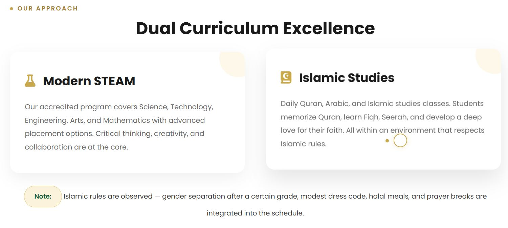
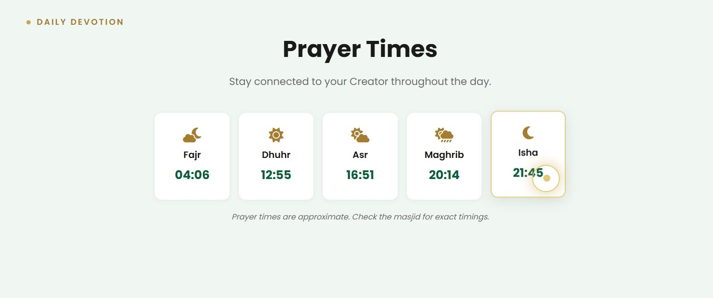
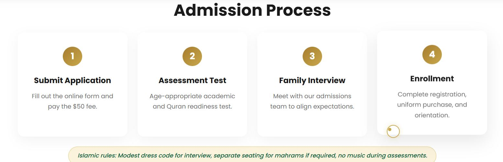
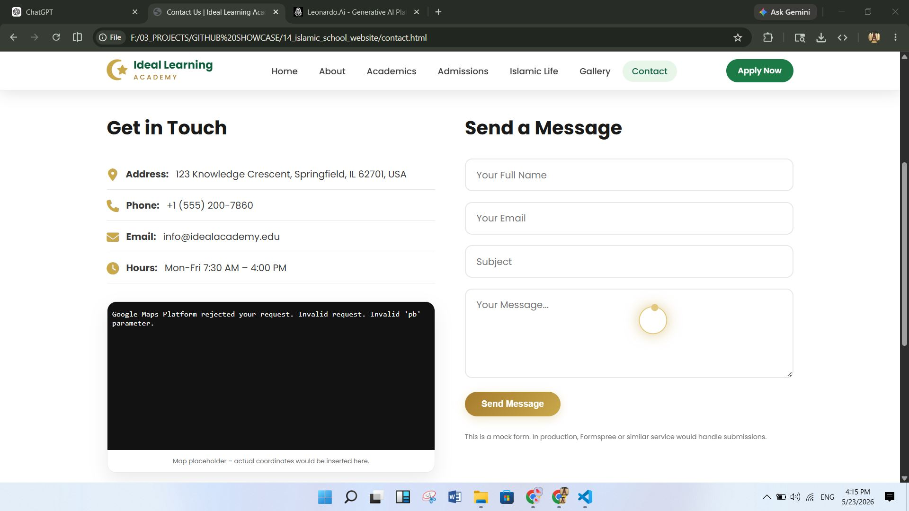
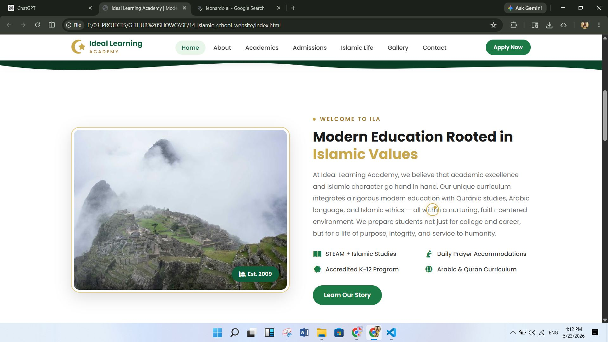
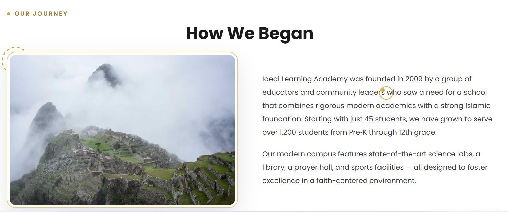
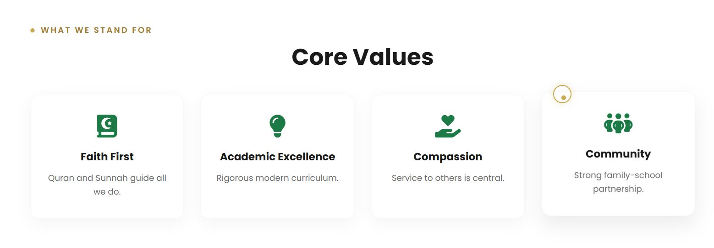
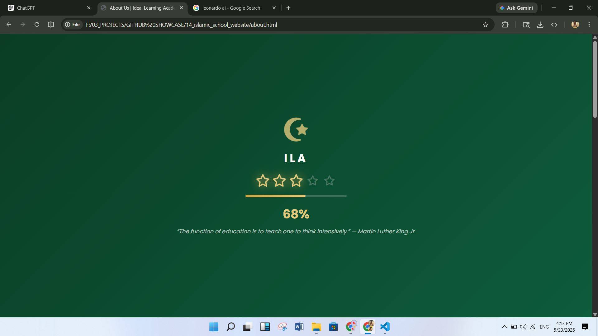

# 🕌 Ideal Learning Academy – Islamic School Website

<div align="center">

### A Modern, Responsive Islamic Educational Institution Website

A beautifully designed, feature-rich website for an Islamic school combining traditional Islamic values with cutting-edge web technologies.

---

[](https://html.spec.whatwg.org/)
[](https://www.w3.org/Style/CSS/)
[](https://www.javascript.com/)
[](https://www.w3schools.com/html/html_responsive.asp)
[](https://fontawesome.com/)
[](LICENSE)

</div>

---

## 📋 Table of Contents

- [✨ Features](#-features)
- [📸 Screenshots](#-screenshots)
- [🛠️ Tech Stack](#️-tech-stack)
- [⚙️ Installation & Setup](#️-installation--setup)
- [🚀 Usage](#-usage)
- [📁 Folder Structure](#-folder-structure)
- [🎯 Future Improvements](#-future-improvements)
- [📝 License](#-license)
- [👤 Author](#-author)

---

## ✨ Features

🎨 **Modern & Beautiful Design**
- Clean, professional interface with Islamic aesthetic
- Custom color scheme (green & gold) representing Islamic tradition
- Smooth animations and transitions throughout

📱 **Fully Responsive**
- Mobile-first design approach
- Optimized for all device sizes (mobile, tablet, desktop)
- Touch-friendly navigation

🕌 **Islamic-Centric Features**
- Islamic prayer times widget with real-time API integration
- Hijri calendar display
- Daily Quran verses and Islamic wisdom
- Student prayer log tracker
- Student Quran progress tracker

🎓 **Educational Tools**
- Comprehensive academics section
- Course curriculum information
- Student dashboard with personalized resources
- Student login system
- Resource library for Islamic learning

🖼️ **Rich Content Sections**
- Interactive gallery with lightbox
- Admissions process showcase
- About institution information
- Contact form integration
- Events countdown feature

⚡ **Performance Optimized**
- Preloader with animated progress indicator
- Custom cursor animation
- Lazy loading for images
- Minimal dependencies (vanilla JavaScript)

🔐 **Professional Features**
- SEO optimized meta tags
- Google Fonts integration (Poppins + Amiri)
- FontAwesome 6 icon library
- Clean semantic HTML5 structure

---

## 📸 Screenshots

### Home Page

*Landing page featuring hero section with institution overview and key information*

### Curriculum Section

*Comprehensive curriculum display showcasing academic programs*

### Daily Devotion

*Daily Islamic verses and wisdom section with Quran tracker*

### Admissions Process

*Clear step-by-step admissions journey for prospective students*

### Contact Page

*Professional contact form and institution information*

### Introduction Section

*Institution introduction and core values presentation*

### Student Journey

*Visual representation of student learning journey at the academy*

### Values Section

*Display of Islamic and educational values*

### Preloader Animation

*Animated preloader with Islamic-themed graphics*

---

## 🛠️ Tech Stack

| Category | Technology |
|----------|-----------|
| **Frontend** | HTML5, CSS3, Vanilla JavaScript |
| **Design** | Responsive CSS Grid & Flexbox |
| **Fonts** | Google Fonts (Poppins, Amiri) |
| **Icons** | FontAwesome 6 |
| **APIs** | Aladhan Prayer Times API |
| **Browser Support** | All modern browsers (ES6+) |

---

## ⚙️ Installation & Setup

### Prerequisites
- A modern web browser (Chrome, Firefox, Safari, Edge)
- Local web server (optional, but recommended for testing)
- Text editor or IDE for modifications

### Quick Start

#### 1. **Clone the Repository**
```bash
git clone https://github.com/yourusername/islamic-school-website.git
cd islamic-school-website
```

#### 2. **Using a Local Server (Recommended)**

**With Python 3:**
```bash
python -m http.server 8000
```

**With Node.js (via http-server):**
```bash
npx http-server
```

**With Live Server (VS Code):**
- Install the "Live Server" extension
- Right-click on `index.html`
- Select "Open with Live Server"

#### 3. **Open in Browser**
```
http://localhost:8000
```

Or simply open `index.html` directly in your browser (though some features may be limited).

### Installation Notes
- No build process required
- No npm/yarn dependencies
- Works with vanilla HTML, CSS, and JavaScript
- All external libraries loaded via CDN

---

## 🚀 Usage

### Main Pages

#### **Home Page** (`index.html`)
Main landing page with:
- Hero section with academy introduction
- Prayer times widget
- Daily Quran verses
- Features overview
- Call-to-action sections

#### **About** (`about.html`)
Institution information featuring:
- Academy mission and vision
- Core values
- Staff and faculty information
- History and achievements

#### **Academics** (`academics.html`)
Educational programs section with:
- Curriculum details
- Course offerings
- Academic calendar
- Grade levels

#### **Admissions** (`admissions.html`)
Admissions information including:
- Application process
- Requirements
- Important dates
- FAQ section

#### **Islamic Life** (`islamic-life.html`)
Islamic education featuring:
- Quran studies
- Islamic principles
- Prayer guidance
- Islamic calendar

#### **Gallery** (`gallery.html`)
Visual showcase with:
- Institution photos
- Events gallery
- Interactive lightbox
- Image categories

#### **Contact** (`contact.html`)
Contact page with:
- Contact form
- Location map
- Contact information
- Social media links

#### **Student Dashboard** (`student-dashboard.html`)
Authenticated student area with:
- Prayer log tracker
- Quran progress tracker
- Personal resources
- Calendar events

### Key JavaScript Features

**Prayer Times** (`js/prayer-times.js`)
- Real-time prayer times via Aladhan API
- Automatic location detection
- Fallback static times

**Quran Tracker** (`js/student-quran-tracker.js`)
- Track Quran reading progress
- Personal study goals
- Progress visualization

**Hijri Calendar** (`js/hijri-calendar.js`)
- Islamic calendar display
- Important Islamic dates
- Holiday highlights

**Gallery Lightbox** (`js/gallery-lightbox.js`)
- Image zoom functionality
- Navigation controls
- Responsive layout

**Event Countdown** (`js/event-countdown.js`)
- Countdown timers for events
- Admission deadlines
- Important dates

**Preloader** (`js/preloader.js`)
- Animated loading screen
- Progress indicator
- Themed animations

**Custom Cursor** (`js/custom-cursor.js`)
- Interactive cursor effects
- Hover animations

---

## 📁 Folder Structure

```
islamic-school-website/
│
├── 📄 index.html                      # Home page
├── 📄 about.html                      # About institution
├── 📄 academics.html                  # Academic programs
├── 📄 admissions.html                 # Admissions information
├── 📄 contact.html                    # Contact page
├── 📄 gallery.html                    # Photo gallery
├── 📄 islamic-life.html              # Islamic education
├── 📄 student-dashboard.html         # Student portal
├── 📄 student-prayer-log.html        # Prayer tracking
├── 📄 student-quran-tracker.html     # Quran progress
├── 📄 student-resources.html         # Resource library
├── 📄 README.md                       # Documentation (this file)
│
├── 📁 css/                            # Stylesheets
│   ├── style.css                     # Main stylesheet
│   ├── responsive.css                # Mobile responsive styles
│   ├── style-about.css               # About page styles
│   ├── style-academics.css           # Academics page styles
│   ├── style-admissions.css          # Admissions page styles
│   ├── style-contact.css             # Contact page styles
│   ├── style-gallery.css             # Gallery page styles
│   ├── style-islamic-life.css        # Islamic life page styles
│   └── style-students.css            # Student dashboard styles
│
├── 📁 js/                             # JavaScript files
│   ├── prayer-times.js               # Prayer times widget
│   ├── hijri-calendar.js             # Islamic calendar
│   ├── student-quran-tracker.js      # Quran tracking
│   ├── gallery-lightbox.js           # Gallery functionality
│   ├── event-countdown.js            # Event timers
│   ├── preloader.js                  # Loading animation
│   ├── student-login.js              # Authentication
│   ├── custom-cursor.js              # Cursor effects
│   └── daily-verse.js                # Daily Quran verse
│
└── 📁 assets/                         # Static assets
    └── screenshots/                   # Project screenshots
        ├── home_page.jpg
        ├── curriculam.JPG
        ├── dialy_devotion.JPG
        ├── admissions_process.JPG
        ├── contact_page.JPG
        ├── intro.JPG
        ├── journey.JPG
        ├── values.JPG
        └── preloader.JPG
```

---

## 🎯 Future Improvements

### Coming Soon 🚀

- [ ] **Backend Integration**
  - Node.js/Express server
  - Database (MongoDB/PostgreSQL)
  - API endpoints for dynamic content

- [ ] **Enhanced Features**
  - Online admission application portal
  - Student grades and transcript system
  - Parent-teacher communication platform
  - Event management system
  - Newsletter subscription

- [ ] **Performance Optimization**
  - Service Worker implementation
  - Progressive Web App (PWA) capabilities
  - Image optimization and lazy loading
  - Build process with webpack/vite

- [ ] **Security**
  - HTTPS enforcement
  - Form validation and CSRF protection
  - Rate limiting for APIs
  - Data encryption

- [ ] **Analytics & Monitoring**
  - Google Analytics integration
  - Error tracking (Sentry)
  - Performance monitoring
  - User behavior insights

- [ ] **Additional Content**
  - Blog section with Islamic articles
  - Alumni network portal
  - Online Quran learning platform
  - Virtual campus tour

- [ ] **Internationalization**
  - Arabic language support
  - Multi-language interface
  - RTL layout support
  - Regional customization

---

## 📝 License

This project is licensed under the **MIT License** – see the [LICENSE](LICENSE) file for details.

### License Summary
- ✅ Free for commercial and private use
- ✅ Modification and distribution allowed
- ✅ Must include license and copyright notice
- ✅ No warranty provided

---

## 👤 Author

**Created with ❤️ for Islamic Education**

- 📧 Email: [Your Email]
- 🐙 GitHub: [Your GitHub Profile]
- 🌐 Website: [Your Portfolio]
- 💼 LinkedIn: [Your LinkedIn]

### Contributing

Contributions, suggestions, and feedback are welcome! 

1. Fork the repository
2. Create a feature branch (`git checkout -b feature/AmazingFeature`)
3. Commit your changes (`git commit -m 'Add AmazingFeature'`)
4. Push to the branch (`git push origin feature/AmazingFeature`)
5. Open a Pull Request

---

## 🙏 Acknowledgments

- **Google Fonts** – Beautiful typography
- **FontAwesome** – Icon library
- **Aladhan API** – Prayer times data
- **Islamic community** – For inspiration and guidance

---

<div align="center">

### ⭐ If you find this project useful, please consider giving it a star!

**Made with passion for modern Islamic education** 🌙📚

</div>
